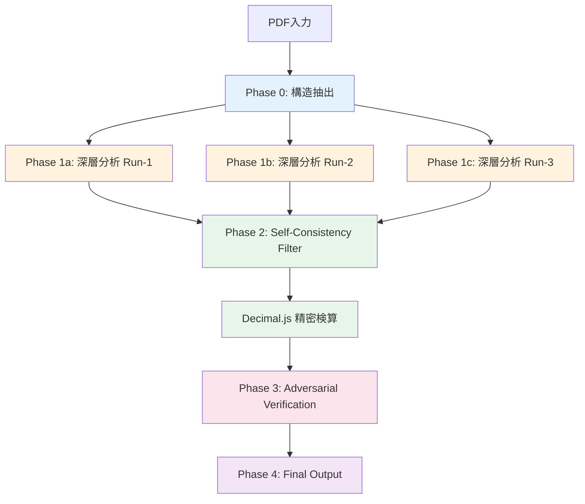
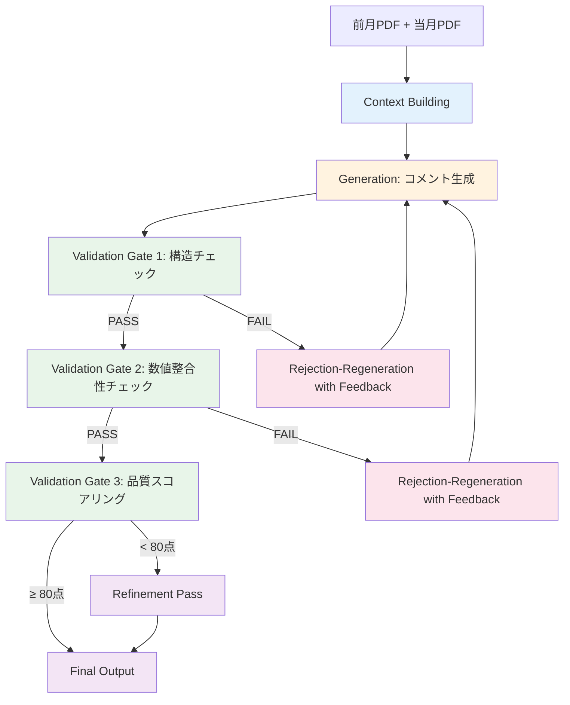

# Financial Analyzer — ワールドクラスAIパイプライン設計書

> 作成日: 2026-03-16
> 対象: コメントチェック機能 + コメント生成機能
> 目標: プロンプトエンジニアリング・LLM研究者100人が感動するレベル

---

## 0. 設計原則

### なぜ2つの機能に異なるパイプラインが必要か

| 観点 | コメントチェック（検出タスク） | コメント生成（生成タスク） |
|------|------|------|
| 目的 | 間違いを**見つける** | 正しいものを**作る** |
| 最大リスク | 見逃し + 誤検出 | 不正確コメント + 推測混入 |
| 品質指標 | Precision（精度）× Recall（再現率） | 正確性 × 文体一致 × 禁止表現なし |
| 最適戦略 | **多重検証 + 敵対的フィルタ** | **バリデーション駆動再生成** |

### 共通テクニック（両機能に適用）

| ID | テクニック | 現状 | 改善 |
|----|-----------|------|------|
| A | thinking_level | 未設定 | `HIGH` に設定 |
| B | Structured Outputs | チェック側未使用 | 両方で `responseSchema` 使用 |
| C-temp | temperature | 0.1（Gemini 3で非推奨） | 削除（デフォルト1.0）+ thinking で制御 |

---

## 1. コメントチェック — パイプライン設計

### 1.1 全体アーキテクチャ



### 1.2 Phase 0: Structure Extraction（構造抽出）

**目的**: 全ページの構造を低コストで俯瞰し、Phase 1 のコンテキストを作る

**モデル**: `gemini-3.1-flash-lite-preview`（最安・最速）
**thinking_level**: `LOW`

**入力**: 全ページのテキスト

**出力スキーマ**:
```typescript
interface Phase0Output {
  reportMeta: {
    reportTitle: string;           // "月次レポート（25/5月）"
    reportPeriod: string;          // "2025年5月"
    totalPages: number;
    currency: string;              // "千円", "百万円"
  };
  pages: Array<{
    pageIndex: number;
    pageTitle: string;
    pageType: "損益計算書" | "貸借対照表" | "キャッシュフロー" | "業績概要" | "注記" | "その他";
    tables: Array<{
      tableTitle: string;
      columns: string[];           // ["項目", "当月", "前月", "累計"]
      keyRows: string[];           // ["売上高", "営業利益", ...]
    }>;
    comments: Array<{
      text: string;                // コメントの原文
      relatedTable: string;        // 関連する表のタイトル
      mentionedPeriod?: string;    // コメントが言及する年月
    }>;
    numericalValues: Array<{
      label: string;
      value: string;               // 原文のまま "1,234千円"
      location: string;            // "表1, 売上高, 当月列"
    }>;
  }>;
  crossReferences: Array<{
    sourcePageIndex: number;
    targetPageIndex: number;
    relationship: string;          // "損益計算書の営業利益 → 業績概要の営業利益"
    sourceValue: string;
    targetValue: string;
  }>;
}
```

**このPhaseの価値**:
- AIに「木を見る前に森を見せる」
- ページ間の参照関係（crossReferences）を明示的に特定
- Phase 1 で「P.3の営業利益はP.8でも参照されている」と伝えられる

---

### 1.3 Phase 1: Deep Analysis × 3（深層分析 × 3回）

**目的**: 計算検証・コメント整合性・誤字脱字を網羅的に検出

**モデル**: `gemini-3.1-pro-preview`
**thinking_level**: `HIGH`
**実行回数**: **3回**（Self-Consistency のため）

**入力**:
- 全ページのテキスト（元データ）
- Phase 0 の出力（構造情報 + ページ間参照マップ）

**プロンプト構造**（Gemini 3 ベストプラクティス準拠）:
```
[Phase 0 の構造情報]

[全ページのテキストデータ]

Based on the information above, analyze this financial report.
（データの後に指示を配置 — Gemini 3 公式推奨）
```

**出力スキーマ**:
```typescript
interface Phase1Finding {
  id: string;                        // 一意ID
  page: number;
  pageTitle: string;
  category: "計算検証" | "コメント整合性" | "ページ横断矛盾" | "誤字脱字" | "更新漏れ" | "その他";
  severity: "エラー" | "注意";
  
  // 根拠の強制引用（Grounded Citation）
  evidence: {
    exactQuote: string;              // PDFからの一字一句引用（必須）
    quoteLocation: string;           // "P.3, 表2, 営業利益, 当月列"
    relatedQuotes?: Array<{          // 関連する別箇所の引用
      exactQuote: string;
      quoteLocation: string;
      pageIndex: number;
    }>;
  };
  
  // 計算検証の場合
  calculation?: {
    operands: string[];              // ["2,000百万円", "766百万円"]
    operation: string;               // "subtract"
    reportedValue: string;           // レポート記載値
  };
  
  // コメント整合性の場合
  commentCheck?: {
    commentText: string;             // コメントの原文
    relatedDataPoint: string;        // 関連する数値データ
    contradiction: string;           // 矛盾の説明
  };
  
  summary: string;                   // 簡潔な指摘概要
  reasoning: string;                 // AIの推論過程
  
  // 確信度（Confidence Calibration）
  confidence: {
    score: number;                   // 0.0 - 1.0
    evidenceStrength: "strong" | "moderate" | "weak";
    alternativeInterpretation?: string;  // 代替解釈（あれば）
  };
}
```

**3回実行の設定差異**:
| Run | seed | 目的 |
|-----|------|------|
| Run 1 | 42 | ベースライン |
| Run 2 | 123 | 異なるサンプリングパス |
| Run 3 | 7 | さらに異なるパス |

---

### 1.4 Phase 2: Self-Consistency Filter（自己一貫性フィルタ）

**目的**: 3回の分析結果を統合し、信頼性の高い指摘のみを残す

**処理**: **システム処理のみ（AIなし）**

```typescript
function selfConsistencyFilter(
  run1: Phase1Finding[],
  run2: Phase1Finding[],
  run3: Phase1Finding[]
): FilteredFinding[] {
  // 1. 指摘の類似性判定（ページ + カテゴリ + 関連箇所が一致）
  // 2. 2回以上出現した指摘のみ採用
  // 3. exactQuote が実際のPDFテキストに存在するか検証
  // 4. 計算検証: Decimal.js で精密検算
  // 5. 3回中の最高 confidence を採用
  // 6. consensus_count (2/3 or 3/3) を付与
}
```

**出力に追加されるフィールド**:
```typescript
interface FilteredFinding extends Phase1Finding {
  consensusCount: 2 | 3;            // 何回検出されたか
  decimalVerification?: {            // Decimal.js 検算結果
    systemCalculated: string;
    difference: string;
    withinTolerance: boolean;
  };
  quoteVerified: boolean;            // exactQuote がPDF内に存在するか
}
```

---

### 1.5 Phase 3: Adversarial Verification（敵対的検証）

**目的**: 各指摘に対して「この指摘が間違っている理由」を生成し、反論に耐えた指摘のみ最終採用

**モデル**: `gemini-3.1-pro-preview`
**thinking_level**: `HIGH`

**プロンプト**:
```
あなたは財務レポートの品質管理担当者です。
以下の指摘事項について、「この指摘が誤りである可能性」を徹底的に検討してください。

指摘: [Phase 2 の各指摘]
レポート原文: [関連部分]

以下の観点で反論を試みてください:
1. 四捨五入・端数処理の影響ではないか？
2. 異なる集計期間・基準による正当な差異ではないか？
3. コメントの解釈に複数の読み方がないか？
4. 表の構造を誤読した可能性はないか？

出力:
{
  "findingId": "...",
  "counterArgument": "...",
  "counterArgumentStrength": "strong" | "moderate" | "weak" | "none",
  "finalVerdict": "confirmed" | "downgraded" | "dismissed",
  "revisedSeverity": "エラー" | "注意" | null
}
```

**フィルタリングルール**:
- `counterArgumentStrength: "strong"` → 指摘を棄却（false positive 除去）
- `counterArgumentStrength: "moderate"` → severity を降格（エラー → 注意）
- `counterArgumentStrength: "weak" | "none"` → 指摘を維持

---

### 1.6 Phase 4: Final Output（最終出力）

Phase 3 を通過した指摘のみを最終結果として返却。

```typescript
interface FinalCheckResult {
  findings: Array<FilteredFinding & {
    adversarialResult: {
      counterArgument: string;
      strength: string;
      verdict: string;
    };
  }>;
  metadata: {
    totalPagesAnalyzed: number;
    analysisRuns: 3;
    initialFindings: number;        // Phase 1 の総指摘数
    afterConsensus: number;         // Phase 2 後の指摘数
    afterAdversarial: number;       // Phase 3 後の指摘数（最終）
    falsePositiveRate: number;      // 除去率
    processingTime: number;
    modelsUsed: string[];
    thinkingTokensUsed: number;     // 監査証跡用
  };
}
```

---

## 2. コメント生成 — パイプライン設計

### 2.1 全体アーキテクチャ

コメント生成は「検出」ではなく「創造」なので、パイプラインが根本的に異なる。



### 2.2 Context Building（コンテキスト構築）

現状の bulk-cache をベースに強化。

**追加要素**:
```typescript
interface EnhancedContext {
  // 既存
  pages: PageData[];
  systemPrompt: string;
  
  // 追加: 前月コメントの構造分析
  previousCommentAnalysis: {
    pageNumber: number;
    wordCount: number;              // 文字数
    sentenceCount: number;          // 文数
    mentionedMetrics: string[];     // 言及された指標
    tone: "neutral" | "positive" | "cautious";  // トーン
    structure: string;              // "概要→詳細→要因" etc
  }[];
  
  // 追加: ページ間の数値依存関係
  numericalDependencies: Array<{
    sourcePageNumber: number;
    targetPageNumber: number;
    sharedMetric: string;           // "営業利益"
  }>;
}
```

### 2.3 Generation（コメント生成）

**現状から変更**:
- `thinking_level: "HIGH"` 追加
- `temperature` 削除（デフォルト1.0）
- 出力スキーマにフィールド追加

**出力スキーマ拡張**:
```typescript
interface EnhancedCommentOutput {
  // 既存フィールド
  comment: string;
  extracted_numbers: Array<{ label: string; value: number; unit: string; change_pct?: number }>;
  variation_factors: Array<{ factor: string; contribution_pct: number; source: string }>;
  confidence_score: number;
  data_source: string;
  speculative_flag: boolean;
  
  // 追加: 数値根拠の明示
  number_citations: Array<{
    numberInComment: string;        // コメント内の数値表現 "1,490千円"
    sourceLocation: string;         // "当月画像, 売上高行, ラボ列"
    verifiable: boolean;            // 画像から直接読み取れるか
  }>;
  
  // 追加: 前月コメントとの対応
  previousCommentAlignment: {
    structureMatch: boolean;        // 構造が前月と一致するか
    coverageOfPreviousTopics: number; // 前月で言及された項目のカバー率 (0-1)
    newTopicsAdded: string[];       // 前月にない新規言及項目
  };
}
```

### 2.4 Validation Gate Cascade（品質ゲートカスケード）

3段階のバリデーションゲートを順番に通過させる。

#### Gate 1: 構造チェック（システム処理、AIなし）
```typescript
function gate1_structuralValidation(output: EnhancedCommentOutput): GateResult {
  const checks = [
    // 既存チェック
    checkBannedWords(output.comment),
    checkSpeculativePatterns(output.comment),
    checkMarkdownPatterns(output.comment),
    
    // 追加チェック
    checkCommentLength(output.comment, previousComment),   // 前月比 ±50% 以内か
    checkAllNumbersCited(output),                          // 言及した数値に全て出典があるか
    check80PercentRule(output.variation_factors),
  ];
  return { passed: checks.every(c => c.valid), issues: checks.filter(c => !c.valid) };
}
```

#### Gate 2: 数値整合性チェック（AIによる検証）
```typescript
// 生成されたコメント内の数値が、画像データと一致するかを
// 別のAI呼び出しで検証する（Self-Verification パターン）
const verificationPrompt = `
以下のコメントに含まれる数値が、画像から読み取れるデータと一致するか検証してください。

コメント: ${output.comment}
画像: [添付]

各数値について:
- コメント内の表現
- 画像から読み取れる値
- 一致 / 不一致 / 画像から確認不可
`;
```

**モデル**: `gemini-3-flash`（検証は高速モデルで十分）

#### Gate 3: 品質スコアリング（AI）

```typescript
interface QualityScore {
  overall: number;                // 0-100
  dimensions: {
    accuracy: number;             // 数値の正確性
    completeness: number;         // 必要な指標のカバー率
    toneConsistency: number;      // 前月コメントとのトーン一致
    conciseness: number;          // 冗長でないか
    actionability: number;        // 実務で使えるか
  };
  improvementSuggestions: string[];
}
```

### 2.5 Rejection-Regeneration（棄却再生成）

**現状の問題**: バリデーション失敗時にリトライするが、「何が悪かったか」をAIに教えていない

**改善**: 失敗理由をフィードバックして再生成

```typescript
async function regenerateWithFeedback(
  originalOutput: EnhancedCommentOutput,
  validationIssues: ValidationIssue[],
  attemptNumber: number
): Promise<EnhancedCommentOutput> {
  const feedbackPrompt = `
前回の出力に以下の問題がありました。修正して再生成してください。

前回の出力:
${originalOutput.comment}

問題点:
${validationIssues.map(i => `- ${i.reason}`).join('\n')}

修正後のコメントを同じJSON構造で出力してください。
上記の問題点を全て解消すること。
`;
  // 最大3回まで再生成
}
```

### 2.6 Refinement Pass（仕上げパス）

Gate 3 で80点未満の場合のみ実行。

```typescript
const refinementPrompt = `
以下のコメントの品質を向上させてください。

コメント: ${output.comment}
品質スコア: ${qualityScore.overall}点
改善提案:
${qualityScore.improvementSuggestions.map(s => `- ${s}`).join('\n')}

スコアが80点以上になるよう改善してください。
ただし、数値や事実は変更しないこと。文体・構成・表現のみ改善すること。
`;
```

---

## 3. コスト・速度試算

### コメントチェック（20ページレポート1件）

| Phase | モデル | 呼び出し数 | Input tokens | Output tokens | 推定コスト |
|-------|--------|-----------|-------------|--------------|-----------|
| Phase 0 | Flash-Lite | 1 | ~30K | ~5K | ~$0.02 |
| Phase 1 | 3.1 Pro × 3 | 3 | ~40K × 3 | ~10K × 3 | ~$0.60 |
| Phase 2 | システム処理 | 0 | - | - | $0 |
| Phase 3 | 3.1 Pro | 1 | ~10K | ~5K | ~$0.08 |
| **合計** | | **5** | | | **~$0.70/レポート** |

### コメント生成（20ページレポート1件）

| Phase | モデル | 呼び出し数 | 推定コスト |
|-------|--------|-----------|-----------|
| Context | - | 0 | $0 |
| Generation | 3.1 Pro × 20ページ | 20 | ~$1.20 |
| Gate 2 検証 | Flash × 20 | 20 | ~$0.10 |
| 再生成（平均3ページ） | 3.1 Pro × 3 | 3 | ~$0.18 |
| **合計** | | **~43** | **~$1.50/レポート** |

### 現状との比較

| | 現状 | 改善後 | 改善率 |
|--|------|--------|--------|
| コメントチェック コスト | ~$0.14 | ~$0.70 | 5倍 |
| コメントチェック 精度 | 中（見逃し・誤検出あり） | 高（多重検証済み） | ⭐⭐⭐ |
| コメント生成 コスト | ~$1.20 | ~$1.50 | 1.25倍 |
| コメント生成 品質 | 中（バリデーションあり） | 高（3段階ゲート + 再生成） | ⭐⭐ |

---

## 4. 実装優先順位

### Phase I（即座に実装 — 共通改善）
> 工数: 1日 / 効果: 大

- [ ] **A**: `thinking_level: "HIGH"` を両機能に追加
- [ ] **C-temp**: `temperature`, `topK`, `topP` を削除（Gemini 3 デフォルト推奨）
- [ ] **B-check**: コメントチェックに `responseSchema` 導入（コメント生成は既にある）

### Phase II（コメントチェック強化）
> 工数: 2-3日 / 効果: 最大

- [ ] **Phase 0**: Structure Extraction の実装
- [ ] **Phase 1**: プロンプト再設計（構造情報をコンテキストに追加）
- [ ] **D**: Self-Consistency（3回実行 + 統合ロジック）
- [ ] **F**: Grounded Citation（exactQuote 必須化）
- [ ] **G-check**: Confidence Calibration + alternative interpretation

### Phase III（コメントチェック仕上げ）
> 工数: 1-2日 / 効果: 大

- [ ] **E**: Adversarial Verification の実装
- [ ] **Phase 2**: Self-Consistency Filter のシステム実装
- [ ] **H**: Progressive Depth（Flash-Lite → Pro の段階処理）

### Phase IV（コメント生成強化）
> 工数: 2日 / 効果: 中

- [ ] 前月コメント構造分析の追加
- [ ] Gate 2: 数値整合性検証（別AI呼び出し）
- [ ] Gate 3: 品質スコアリング
- [ ] Rejection-Regeneration with Feedback
- [ ] number_citations の追加

---

## 5. Gemini 3 固有の注意事項

### プロンプトベストプラクティス（公式ガイドより）

1. **データを先、指示を後に配置**
   ```
   [全ページのテキストデータ]
   
   Based on the information above, analyze...
   ```

2. **簡潔な指示を使う**
   - Gemini 3 は過度なプロンプトエンジニアリングを嫌う
   - Chain of Thought は thinking_level で自動処理されるので、手動で「ステップバイステップで...」と書かない

3. **temperature はデフォルト（1.0）を推奨**
   - 低い temperature はループや性能劣化を引き起こす可能性がある
   - 決定的な出力が必要な場合は thinking_level で制御

4. **PDF理解の強化**
   - `media_resolution: "high"` 設定で密なドキュメントの精度向上
   - ただしトークン消費が増加するので注意

---

*Financial Analyzer AI Pipeline Design v1.0*
*設計: 2026-03-16*
